# Veterinaria Animalia S.A - CRUD de inventario en Python
Proyecto colaborativo de CRUD de inventario y sistema de inicio de sesión en Python desarrollado durante el ciclo II del curso de Proyecto Desarrollo de Software I- IDAT. Contiene funcionalidades diseñadas para una empresa veterinaria, incluyendo gestión de inventario, inicio de sesión de usuarios, gestión de pacientes, registros médicos y citas.

 

## 📷 Capturas de pantalla
<table style="width: 100%">
  <tr>
    <td style="width: 50%">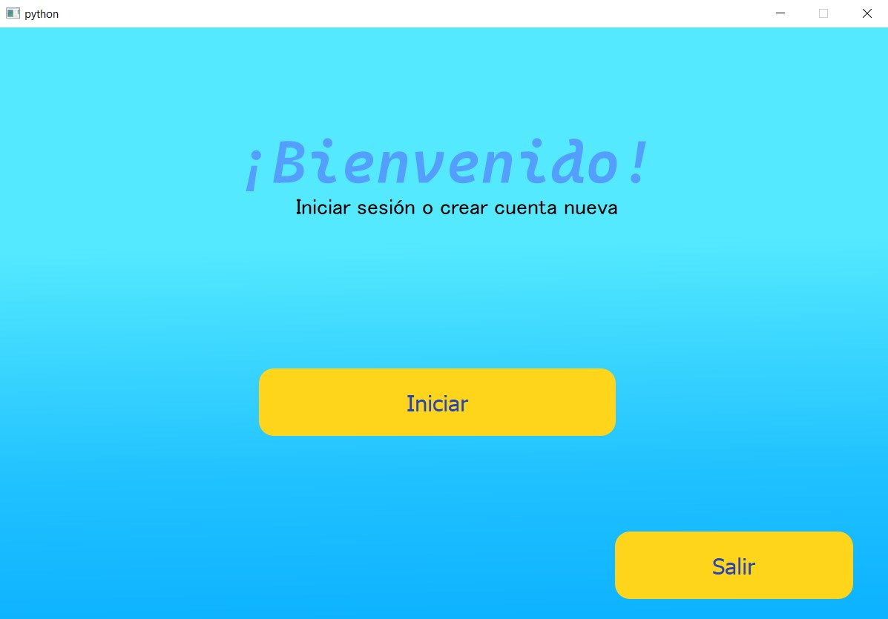</td>
    <td style="width: 50%">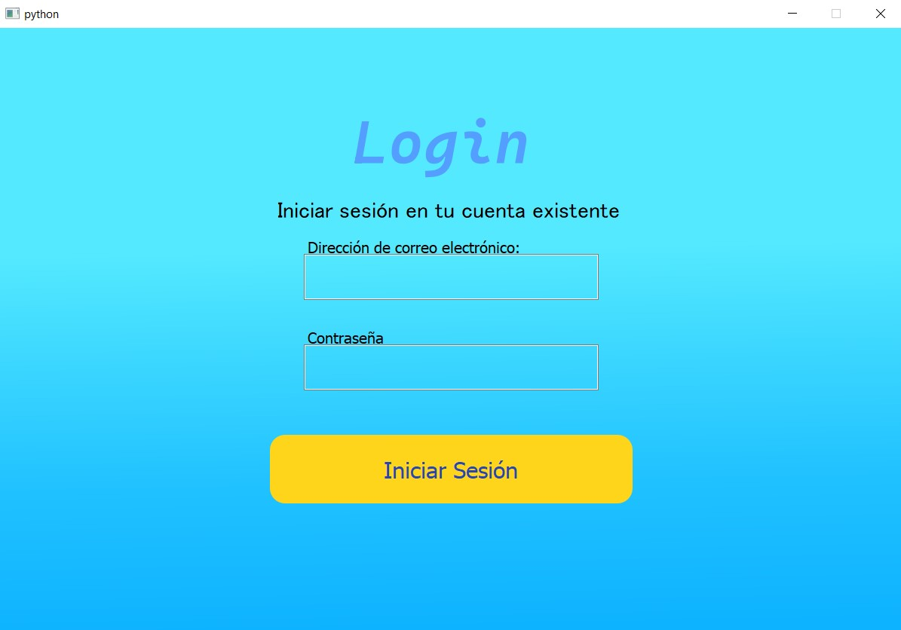</td>
  </tr>
  <tr>
    <td>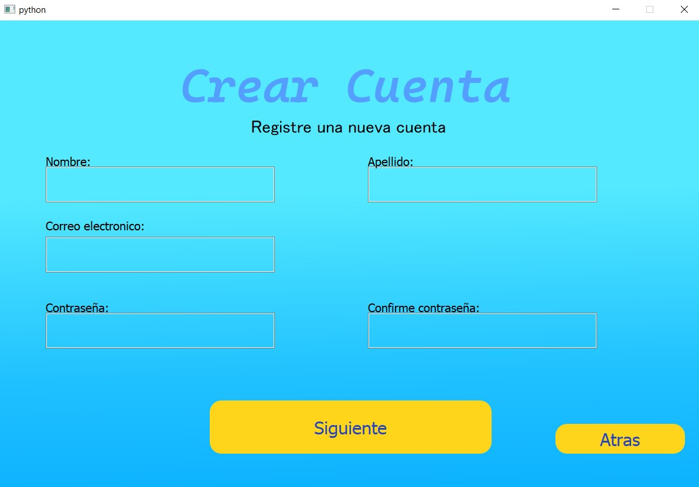</td>
    <td>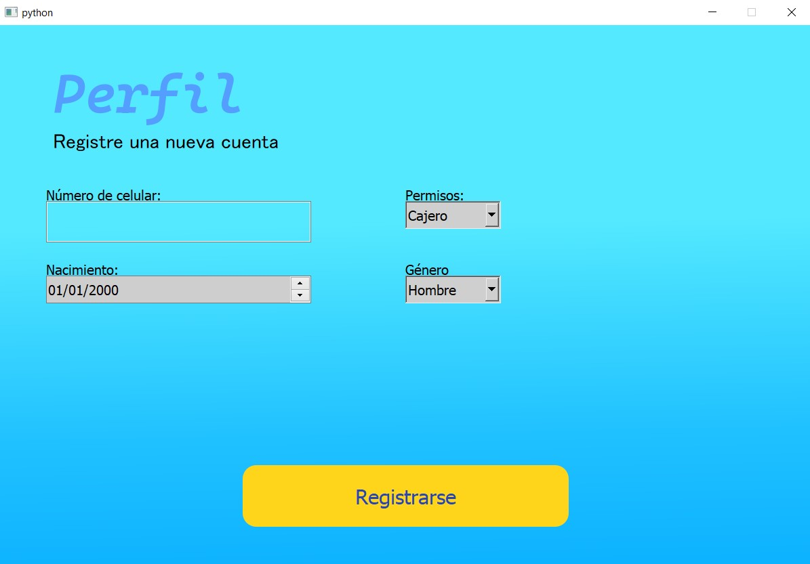</td>
  </tr>
  <tr>
    <td>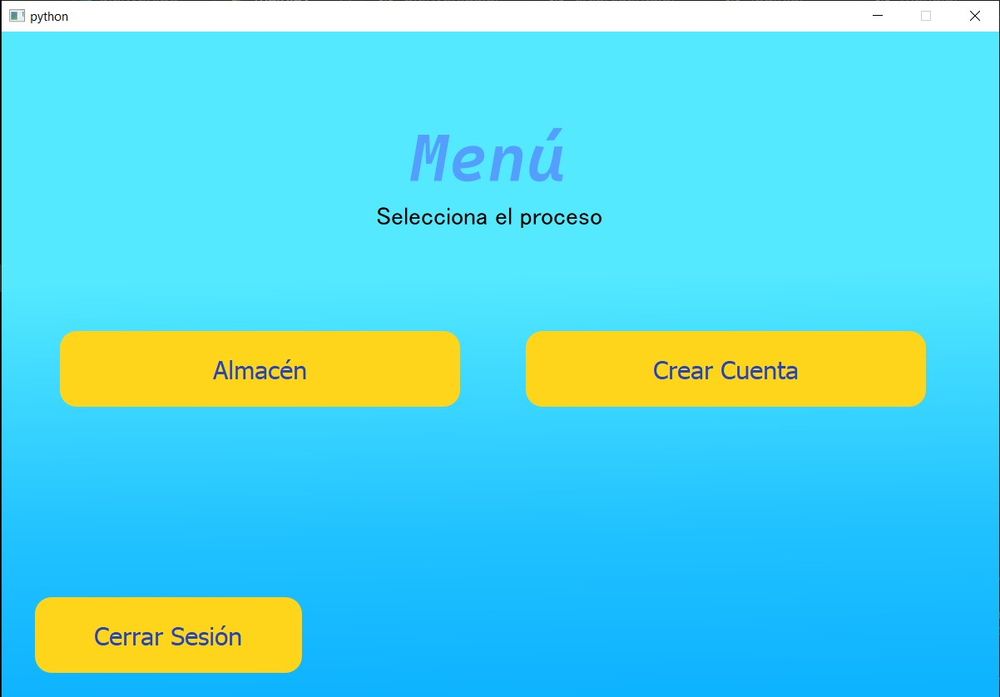</td>
    <td>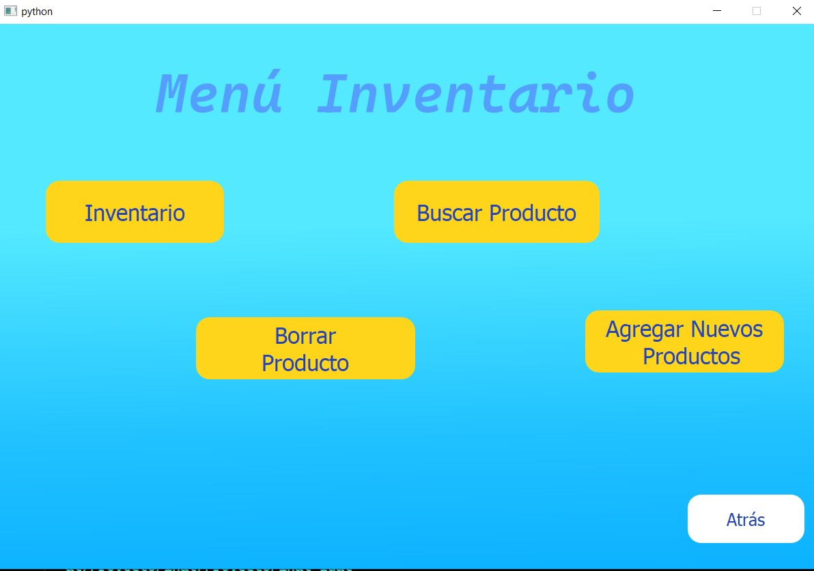</td>
  </tr>
  <tr>
    <td>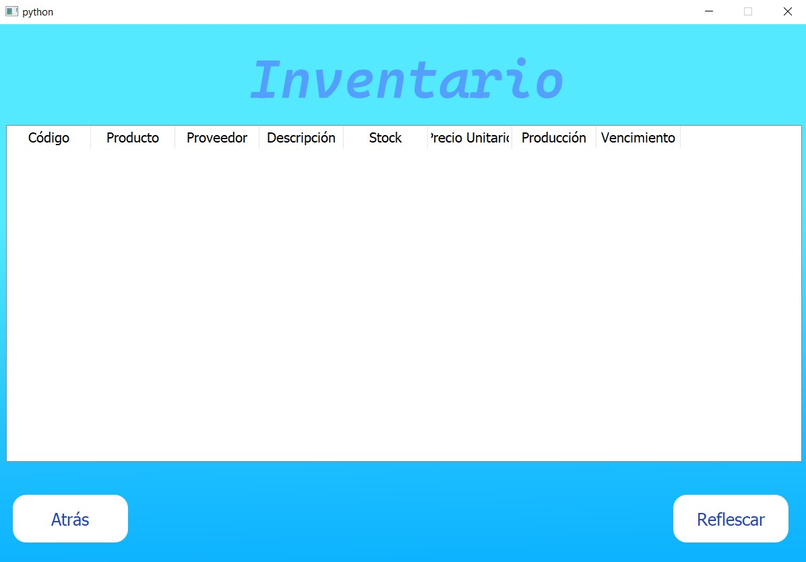</td>
    <td>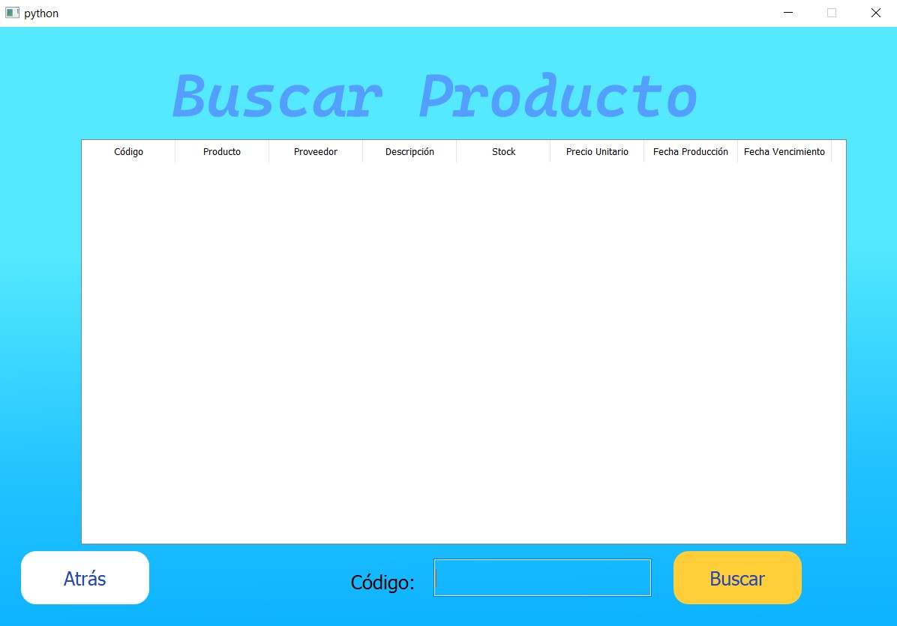</td>
  </tr>
  <tr>
    <td>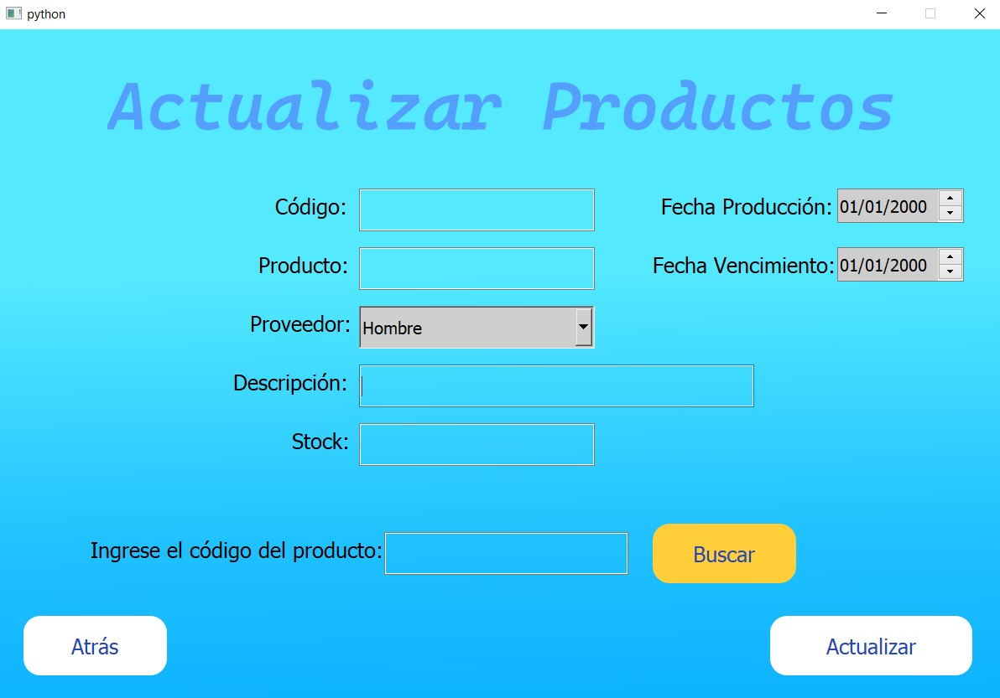</td>
    <td>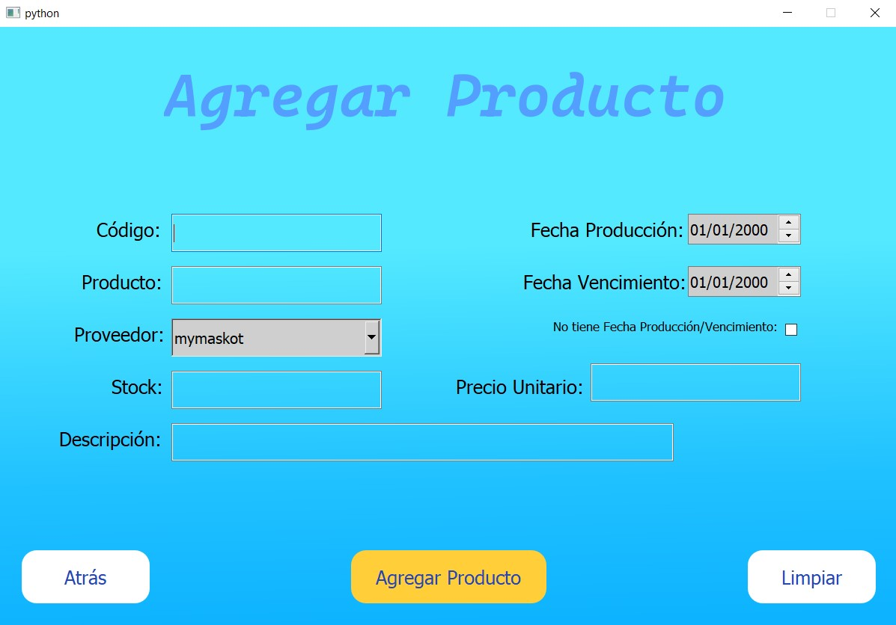</td>
  </tr>
  <tr>
    <td colspan="2">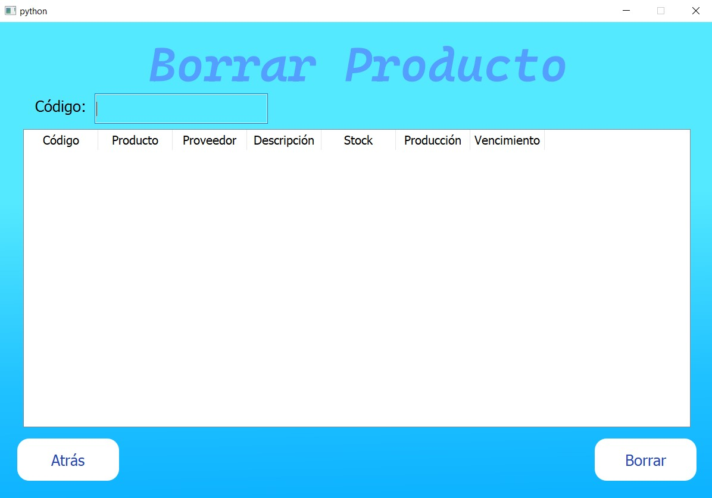</td>
  </tr>
</table>
